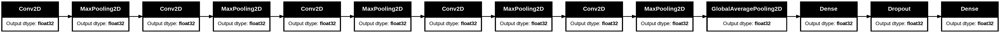
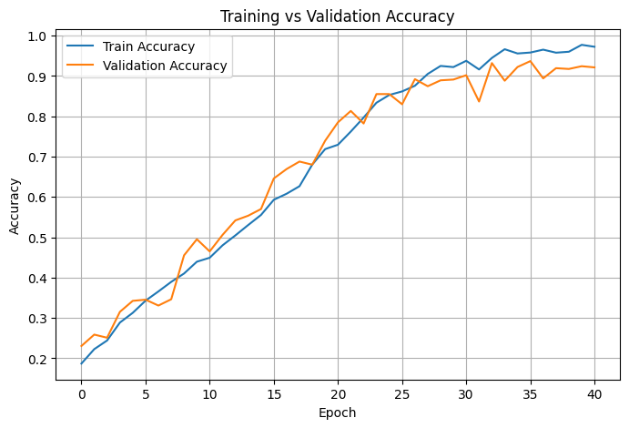

# 🦷 Teeth Classification using CNN  
### AI-Powered Dental Image Classification System

---

## 🌐 Live Demo

🔗 **Streamlit App:**  
https://teeth-classification-cnn.streamlit.app/

---

## 📌 Project Overview

This project presents an end-to-end **AI-powered dental image classification system** built using a **Convolutional Neural Network (CNN)**.

The model classifies dental images into **7 distinct oral disease categories**, forming a baseline intelligent diagnostic support tool for dental healthcare applications.

This project represents the first phase of a larger AI-driven medical initiative focused on improving diagnostic accuracy in dental imaging.

---

## 🎯 Objectives

- Preprocess and normalize dental images for stable CNN training  
- Apply **data augmentation** to enhance generalization  
- Analyze dataset balance using visualization techniques  
- Build a **CNN model from scratch using TensorFlow**  
- Establish a strong baseline performance  
- Deploy the trained model using **Streamlit Community Cloud**

---

## 🦷 Disease Classes

The model classifies images into the following 7 categories:

- **CaS**
- **CoS**
- **Gum**
- **MC**
- **OC**
- **OLP**
- **OT**

---

## 🧠 Model Architecture

A CNN model was built from scratch with:

- Multiple `Conv2D` layers for feature extraction  
- `MaxPooling2D` for spatial downsampling  
- `GlobalAveragePooling2D` to reduce parameters  
- Fully connected `Dense` layers for classification  
- `Dropout` layers to reduce overfitting  

### 📊 Architecture Diagram



---

## 📊 Dataset & Preprocessing

All images were:

- Resized to **256 × 256**
- Normalized to pixel range **[0, 1]**
- Augmented using:
  - Rotation
  - Horizontal flipping
  - Zooming

These techniques improve robustness and reduce overfitting.

---

## 📈 Training Performance

The model achieved:

- Strong training accuracy  
- Stable validation accuracy  
- Smooth loss convergence  
- No significant overfitting  

### Training vs Validation Accuracy



---

## 🚀 Deployment

The trained model was deployed using:

- Streamlit  
- TensorFlow 2.20  
- Streamlit Community Cloud  

Users can:

- Upload a dental image  
- Receive predicted disease class  
- View model confidence score  

---

## 📁 Project Structure


## Project Structure

```
teeth-classification-cnn/
│
├── app.py # Streamlit application
├── requirements.txt # Dependencies
│
├── images/ # Visual assets
│ ├── model.png
│ ├── output.png
│ └── training_validation_accuracy.png
│
├── model/
│ └── best_model.h5 # Trained CNN model
│
├── dataset/ # Processed dataset
├── notebook/ # Jupyter notebooks
└── pdf_task/ # Project documentation
```

---

## 🛠 Technologies Used

- Python  
- TensorFlow / Keras  
- NumPy  
- Matplotlib  
- Streamlit  
- Git & GitHub  

---

## 👩‍💻 Author

**Armia Gamal**  
AI & Computer Vision Enthusiast  

🔗 GitHub: https://github.com/Armia-Gamal  
🔗 LinkedIn: https://www.linkedin.com/in/armia-gamal/

---

## ⭐ Final Note

This project demonstrates the practical integration of:

- Deep Learning  
- Medical Imaging  
- Model Deployment  

into a real-world AI healthcare application.
